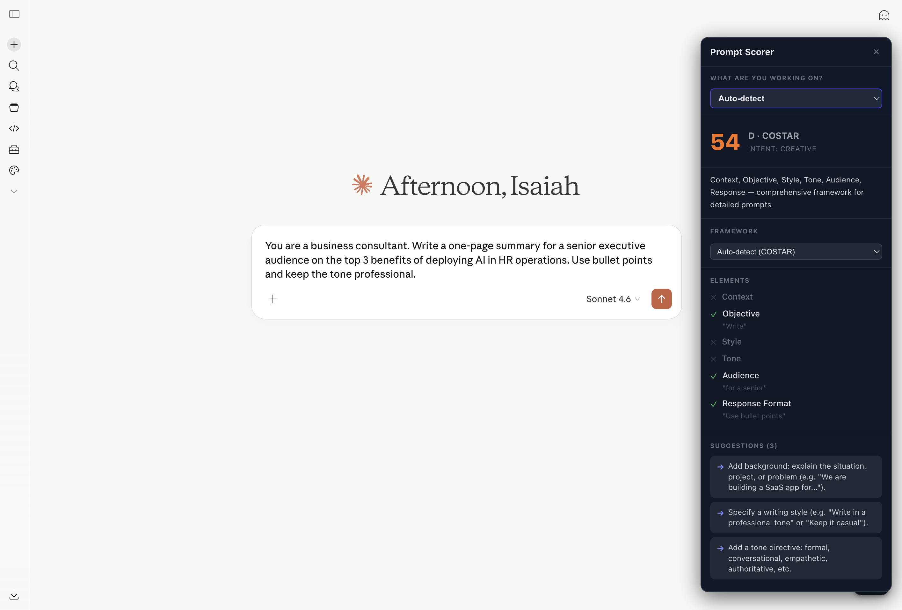

# PromptIQ

Score your AI prompts before you send them.

PromptIQ is a Chrome extension that analyzes your prompt in real time against 8 proven prompt engineering frameworks — and tells you exactly what's missing before you waste tokens on a bad response.

---

## How it works

Type a prompt in Claude, ChatGPT, or Gemini. A score badge appears in the corner.

- **F · 12** — weak prompt, missing role, format, goal
- **A · 91** — strong prompt, ready to send

Click the badge to see which elements are present, which are missing, and how to fix them.

---

## Supported sites

- claude.ai
- chatgpt.com
- gemini.google.com

---

## Frameworks

PromptIQ auto-detects the best framework for your prompt type, or you can pick manually.

| Framework | Best for |
|---|---|
| COSTAR | Creative, detailed prompts |
| RTF | Quick, focused prompts |
| RISEN | Coding and technical tasks |
| CRISPE | Research and analysis |
| APE | Explanations |
| CARE | Business outcomes |
| TAG | One-liners |
| BROKE | Strategy and planning |

---

## Install (Beta)

> Requires Google Chrome, Brave, Arc, or any Chromium browser.

1. Download the latest zip from [Releases](../../releases)
2. Unzip it somewhere permanent — do not delete after installing
3. Open `chrome://extensions`
4. Enable **Developer mode** (top right toggle)
5. Click **Load unpacked** → select the `dist` folder inside the unzipped folder
6. Open Claude.ai or ChatGPT and start typing

---

## Score guide

| Grade | Score | Meaning |
|---|---|---|
| A | 85–100 | Strong — ready to send |
| B | 70–84 | Good — minor gaps |
| C | 55–69 | Usable — improvements recommended |
| D | 40–54 | Weak — missing key elements |
| F | 0–39 | Needs rework |

---

## Privacy

No data leaves your browser. No account required. No API key. Scoring runs entirely on-device.

---

## Feedback

Found a bug or a prompt that scores wrong? Open an issue or visit [redotdigital.com](http://redotdigital.com).
